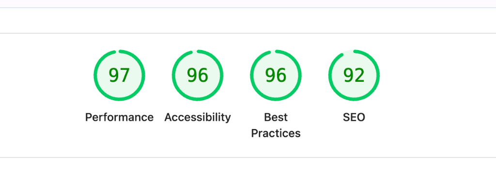

# FUGA – Music Product Management System

## Overview
FUGA is a high-performance music product management system designed for a modern, music-centric environment. The platform provides a seamless interface for managing digital music assets, featuring enterprise-grade performance and a secure authentication model where **catalogue browsing is public**, while all management actions are strictly protected via **Auth0 PKCE**.

## Project Description
FUGA is a purpose-built product management system tailored for music companies. The system enables seamless management of digital assets with a clear distinction between public discovery and secure administration:

- **Auth-Protected Management**: A secure interface for creating and updating products with metadata (Name, Artist Name) and cover art uploads. These actions, along with product deletion, require authentication via the **Auth0 PKCE flow**.
- **Dynamic Public Asset Library**: A high-performance viewing experience for the entire catalog, featuring optimized thumbnails and integrated product details accessible to all users without authentication.

---

## Technical Requirements (Implemented)

### Service (Backend - Node.js)
- **CRUD Operations**: Full Create, Read, Update, and Delete operations for managing products and artists.
- **API Endpoints**: RESTful API designed with Zod validation, comprehensive error handling, and security hardening.
- **Direct-to-Cloud Interoperability**: Generates secured AWS S3 Presigned URLs, offloading high-bandwidth file transfers entirely away from the Node.js event loop.
- **API Documentation**: Interactive documentation available via Swagger/OpenAPI.

### Client Application (Frontend - React)
- **UI for Product Creation**: User-friendly, accessible interface for entering product details and uploading cover art.
- **Product List Display**: High-performance grid interface with infinite scrolling, cover art thumbnails, and instant hybrid search.

---

## Tech Stack

| Layer | Technology |
|-------|-----------|
| **Backend** | Node.js · Express · TypeScript · PostgreSQL · Prisma · Auth0 (JWT) · Zod · AWS SDK 3 · Helmet |
| **Frontend** | React 19 · React Compiler · Auth0 (PKCE) · Vite 7 · TypeScript · Tailwind CSS v4 · TanStack Query v5 · Image Compression |
| **Infra** | Docker · Docker Compose (Dev/Prod) · GitHub Actions (CI) |
 
---
 
## Lighthouse Results (Production Mode)
 
The application is highly optimized for performance, accessibility, and SEO.
 
| Performance | Accessibility | Best Practices | SEO |
|-------------|---------------|----------------|-----|
| **97**      | **96**        | **96**         | **92** |
 


---

## Authentication Configuration

FUGA uses **Auth0 PKCE** for secure, enterprise-grade authentication.

### Industrialized Setup
- **Centralized Configuration**: All frontend Auth0 settings are securely managed and validated in `frontend/src/config/auth.ts`.
- **Custom AuthProvider**: A dedicated `AuthProvider` component handles seamless programmatic navigation (`onRedirectCallback`) and reliable session persistence via `localStorage`.
- **Backend JWT Verification**: The backend uses `express-oauth2-jwt-bearer` to automatically verify JWT signatures, audience, and issuer using Auth0's public keys.

### Required Environment Variables
Ensure your `.env` files contain the following Auth0 configuration:

**Frontend (`frontend/.env`)**
```bash
VITE_AUTH0_DOMAIN=your-tenant.auth0.com
VITE_AUTH0_CLIENT_ID=your-client-id
VITE_AUTH0_AUDIENCE=https://api.fuga.music
```

**Backend (`backend/.env`)**
```bash
AUTH0_ISSUER_BASE_URL=https://your-tenant.auth0.com
AUTH0_AUDIENCE=https://api.fuga.music
```

---

## Quick Start (Docker)

The fastest way to get started is using Docker Compose.

```bash
# Clone the repo
git clone <repo-url> && cd FUGA

# Create environment file (defaults provided)
cp .env.example .env

# Start all services
docker compose up --build
```

**Access points:**
- **App**: [http://localhost:5173](http://localhost:5173) (Dev) or [http://localhost:3000](http://localhost:3000) (Prod)
- **API Docs**: [http://localhost:4000/api-docs](http://localhost:4000/api-docs)

---

## CLI Commands (Makefile)

The project includes a `Makefile` for streamlined development and environment management.

### Environment Lifecycle
| Command | Description |
|---------|-------------|
| `make up` | Build and start all services (Docker) |
| `make down` | Stop all running services |
| `make logs` | Stream logs from all containers |
| `make clean` | Deep cleanup (Removes containers, volumes, and images) |

### Database Management
| Command | Description |
|---------|-------------|
| `make db-migrate-dev` | Run Prisma migrations (Development) |
| `make db-migrate` | Deploy Prisma migrations (Production) |
| `make db-seed` | Populate the catalog with 50 music products |

### Quality & Tests
| Command | Description |
|---------|-------------|
| `make test` | Run all backend and frontend unit tests |
| `make lint` | Run linting checks across the entire stack |

---

## Project Structure

```
FUGA/
 ├─ backend/
 │   ├─ src/
 │   │   ├─ config/          # Zod env · Security (Helmet/CORS) · Swagger
 │   │   ├─ modules/products/ # Clean architecture: router → controller → service → repository
 │   │   ├─ middlewares/     # auth (Auth0 JWT) · rateLimiter · validate · errorHandler
 │   │   └─ lib/             # Storage service (Local/S3) · Prisma client · Logger
 │   └─ prisma/              # Schema & migrations
 ├─ frontend/
 │   └─ src/
 │       ├─ config/          # Centralized Auth0 & Application settings
 │       ├─ components/      # AuthProvider · Navbar · ProtectedRoute
 │       ├─ features/products/
 │       │   ├─ components/  # ProductCard · ProductGrid · ProductForm
 │       │   ├─ containers/  # Domain-specific logic containers
 │       │   ├─ hooks/       # Custom React Query & Infinite Scroll hooks
 │       │   └─ utils/       # Business logic & validation utilities
 │       ├─ store/           # Redux Toolkit setup (global UI state)
 │       └─ lib/             # Hardened apiClient (Bearer Token injection)
 └─ .github/workflows/      # Automated CI/CD pipelines
```

---

## API & Security

### Security Measures
- **Rate Limiting**: Protection against DDoS and brute-force (1000 reqs/15m global, 100 reqs/15m for writes).
- **Authentication**: **Auth0 PKCE & JWT Verification** required for all state-changing operations.
- **Hardened Headers**: Strict CSP, X-Frame-Options (Clickjacking protection), and HSTS.
- **Input Sanitization**: Global Zod validation middleware for all request payloads.

### Endpoints
| Method | Path | Auth | Description |
|--------|------|------|-------------|
| `GET` | `/api/products` | ❌ | Paginated list with search/filters |
| `GET` | `/api/products/:id` | ❌ | Detailed product view |
| `POST` | `/api/products` | ✅ | Create new product (Auth0 required) |
| `PUT` | `/api/products/:id` | ✅ | Update product (Auth0 required) |
| `DELETE` | `/api/products/:id` | ✅ | Permanently delete product (Auth0 required) |

---

## Architecture Decisions

| Decision | Rationale |
|----------|-----------|
| **Auth0 PKCE** | Industry-standard security for Single Page Applications, eliminating the risk of hardcoded secrets and providing seamless OAuth2/OIDC integration. |
| **Infinite Scroll** | Eliminates pagination latency; uses scroll-triggered data fetching for a modern mobile-first UX. |
| **Hybrid Search** | Instant UI feedback via client-side filter for loaded items + server-side fallback for large datasets. |
| **Container-Presenter**| Decouples data fetching from UI, making components pure, highly testable, and reusable. |
| **Defense in Depth** | Multiple security layers (Rate limit → Auth0 JWT → Validation) ensure robust API protection. |
| **React Compiler** | Automatic memoization reduces manual `useMemo`/`useCallback` overhead while ensuring 60FPS UI. |
| **Relational Metadata**| Moving from a flat URL to an `Image` model allows the UI to reserve space (Width/Height) accurately, eliminating Layout Shift. |
| **Shimmer UI (Skeleton)**| Implements pure-CSS native `animate-pulse` and `opacity` transitions while images load dynamically over the network, providing instant, premium perceived performance during infinite scrolling. |
| **Optimistic Direct Uploads** | Client-side image compression (`browser-image-compression`) combined with S3 Presigned URLs shifts compute costs to the browser, eliminating the need for expensive AWS Lambda triggers or heavy Node.js memory buffers. |

---

### CI (GitHub Actions)
Fully automated CI pipeline on every push:
- **Linting & Type-checking**
- **Unit & Integration Testing**
- **Production Build Validation**
- **Docker Image Build Verification**

---

## Future Enhancements & Architectural Trade-offs

### 1. Multi-Artist Collaborations & Secondary Assets
- **Implementation**: The current schema links images directly to artists.
- **Enhancement**: Scaling this to support multi-artist tracks and "Artist Libraries" where common brand assets (logos, profile banners) can be managed once and reused across hundreds of products.
